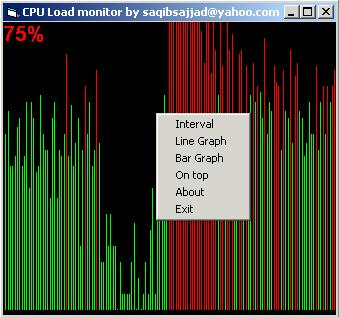



## Cpu Load Monitor for XP/NT/2K/9X

### Description

This is a small project which monitors CPU load

and displays the load as a graph. Graph can be

line or bar (chosen by popup menu). visit my website http://vb.craftspakistan.com
 
### More Info
 

             |
---                |---
**Submitted On**   |2004-02-07 18:52:08
**By**             |[Saqib Sajjad](https://github.com/Planet-Source-Code/PSCIndex/blob/master/ByAuthor/saqib-sajjad.md)
**Level**          |Advanced
**User Rating**    |4.0 (16 globes from 4 users)
**Compatibility**  |VB 3\.0, VB 4\.0 \(16\-bit\), VB 4\.0 \(32\-bit\), VB 5\.0, VB 6\.0
**Category**       |[Complete Applications](https://github.com/Planet-Source-Code/PSCIndex/blob/master/ByCategory/complete-applications__1-27.md)
**World**          |[Visual Basic](https://github.com/Planet-Source-Code/PSCIndex/blob/master/ByWorld/visual-basic.md)
**Archive File**   |[CPU\_Load\_m170537272004\.zip](https://github.com/Planet-Source-Code/saqib-sajjad-cpu-load-monitor-for-xp-nt-2k-9x__1-51566/archive/master.zip)

